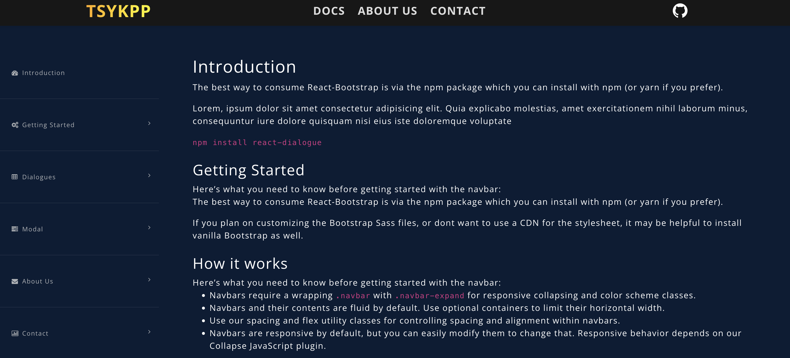

# TSYKPP Modal UI PROJECT

<span style="color: skyblue; font-size: 12px; ">
*Documentation Website*
</span>

[](https://tskypp.vercel.app/)

> Languages & Libraries
  *  React (Vite) Node v18 required
  *  Sass
  *  Storybook
  *  RollUp


 # Getting started by cloning

<span style="color: red; font-size: 12px; ">* This may not work depending on your PC</span>

  `npm i `

  `npm run storybook`


## How to create your own UI
    src -> components -> Your Folder -> YourModal.jsx

    src -> stories -> Your Folder -> YourModal.stories.jsx

    src -> index.js -> export { default as YourModal }from './components/YourFolder/YourModal.jsx'


## Build the project (RollUp)

<span style="color: red; font-size: 12px; ">change the version first in package.json</span>

  `npm run build-rollup`

## Update (Publish) the project
   You must test the project before and after publish

    `npm login`

    `npm publish`


--------------

#  How to use the components from other projects

  `npm i tsykpp`

   In App.jsx

    import 'tsykpp/dist/index.css';

    import { KazModal, ThuptenModal } from 'tsykpp';

    ```
    <> 
      <KazModal /> 
      <KazModal variant="red" />
      <ThuptenModal /> 
    </>
    ```


## Available Components at the moment
  *   { KazModal }
  *  { ThuptenModal }

--------------
# Getting Started from scratch

<span style="color: red; font-size: 12px; ">* This may not work depending on your PC</span>

   1. Install React

       `npm crate vite@latest` 

   2. Move directory

       `cd Your project folder`

   3. Install Sass

       `npm i sass`

  4. Install Storybook
  
       `npx sb init`

  5. Install RollUp & postcss & its packages

       ```npm i @babel/core @babel/preset-react @rollup/plugin-babel @rollup/plugin-commonjs @rollup/plugin-node-resolve rollup rollup-plugin-peer-deps-external rollup-plugin-postcss```

  6. Configure the rollup.config.js
  
  ```
import peerDepsExternal from 'rollup-plugin-peer-deps-external';
import resolve from '@rollup/plugin-node-resolve';
import commonjs from '@rollup/plugin-commonjs';
import babel from '@rollup/plugin-babel';
import postcss from 'rollup-plugin-postcss';
 
export default {
  input: 'src/index.js',
 
  output: [
    {
      file: 'dist/index.js', 
      format: 'cjs',       
    },
    {
      file: 'dist/index.esm.js', 
      format: 'esm',        
    }
  ],
  plugins: [
    peerDepsExternal(), 
    resolve(),    
    commonjs(),   
    babel({
      babelHelpers: 'bundled',
      exclude: 'node_modules/**',
      presets: ['@babel/preset-react'] 
    }),
 
    postcss({
      extensions: ['.scss', '.css'], 
      use: [
        ['sass', {
          includePaths: ['./src/styles', './node_modules']
        }]
      ],
      minimize: true, 
      extract: true, 
    }),
  ],
  external: ['react', 'react-dom'],
};
```

-----
7. Delete default stories folder (If you clone this file, No need)

8. Add components folder & stories folder in src (If you clone this file, No need)
----

9. Add this code to  .eslintrc.cjs  to avoid some warnings
 

  ```
  rules: {
      "react/prop-types": "off",// turn off warning for prop-types
      "no-unused-vars": "off", // turn off warning for import React 
    },
  ```

10. Create an entry point
 

    crate index.js in src directory and export all UI components from here
    ```
    export { default as KazModal } from './components/Kaz/KazModal.jsx';
    export { default as ThuptenModal } from './components/Thupten/Modal.jsx';
    ```
 
 
11. Build UI components with RollUp
 

```npx rollup -c```
 
12. Publish the project to NPM

    `npm login`

    `npm publish`

-----

> Issues at the moment

* rollup deprecated warnings
