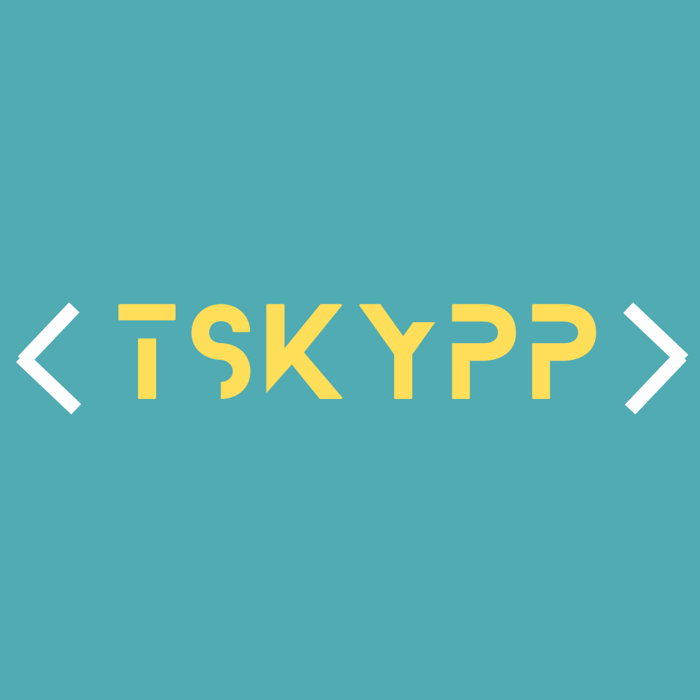

 <br>

# react-easy-modal

## Table

- [Installation](#installation)

- [Examples](#example)

- [Customization](#customization)

- [About](#about)

- [Demos](#demos)

## Installation

To install, you can use [npm](https://www.npmjs.com/package/react-handy-modal) or [yarn](https://www.npmjs.com/package/react-handy-modal):

- `npm install  ` or `yarn add `.

```sh
  $ npm install react-easy-modal
  $ yarn add react-easy-modal
```

## Packages

You can install the latest version by using:
| Name | Version |
| :-------------------------------------------------------------------------------- | :-----------------------------------------------: |
| [`react-handy-modal`](https://www.npmjs.com/package/react-handy-modal) | [[1.0.1](https://www.npmjs.com/package/react-handy-modal) ] |

## Example

Here is a simple example of react-modal being used in an app with some custom styles and focusable input elements within the modal content:

## Basic

```js
import { Dialog, Button, Flex } from "react-handy-modal";
```

## Use as a component:

```js
<div>
  <Dialog.Root>
    <Dialog.Trigger>
      <Button
        variant="solid"
        textColor="rgb(251, 251, 251)"
        bgColor="rgb(47, 46, 46)"
      >
        Open Modal
      </Button>
    </Dialog.Trigger>
    <Dialog.Content position={"slide-up"}>
      <Dialog.Title>Opened Modal</Dialog.Title>
      <Dialog.Description>Lorem ipsum dolor, sit amet</Dialog.Description>
      <Flex gap="20px" mt="60px" justify="end">
        <Dialog.Cancel>
          <Button variant="soft">Cancel</Button>
        </Dialog.Cancel>

        <Dialog.Action>
          <Button variant="solid" bgColor="rgb(30, 75, 210">
            Do something
          </Button>
        </Dialog.Action>
      </Flex>
    </Dialog.Content>
  </Dialog.Root>
</div>
```

## Props

<!-- Flex Component -->

The `Flex` component accepts the following props:

- `gap` (string, optional): Gap between child elements within the flex container.

- `mt` (string, optional): Top margin for the flex container.

- `justify` (string, optional): Horizontal alignment of child elements within the flex container.

The `Content` component accepts the following props:

- `position` (string, optional): Position of the dialog content (either 'default' or custom).

The `Button` component accepts the following props:

- `textColor` (string, optional): Text color of the button.
- `variant` (string, optional): Button style, which can be 'solid', 'soft', or any other value.
- `bgColor` (string, optional): Background color of the button.

## Customization Options

Here are the customization options for the modal:

### Adjust Gap Between Child Elements:

- To change the gap between child elements within the flex container, use the gap prop.

- You can specify the desired gap as a string value.

### Set Top Margin:

- Modify the top margin of the flex container by using the mt prop.

- Provide the desired margin value as a string.

### Horizontal Alignment of Child Elements:

- Customize the horizontal alignment of child elements within the flex container by setting the justify prop.
- You can choose from options like `'flex-start'`, `'center'`, `'flex-end',` or any other valid alignment value.

### Change Animation Position:

- The modal provides animation options for sliding up , sliding down and fade In.

- You can set the animation position by specifying the position prop when rendering the Content component. Choose either `'slide-up'`,`'slide-down'`, `'full-screen'` based on your preference.

### Button Text and Style:

- Change the text displayed on the button by providing content as the component's children.

- Adjust the text color and background color of the button by using the `textColor` and `bgColor` props, respectively.

### Button Style Variant:

- Customize the button's style by setting the variant prop to either `'solid' `or `'soft'` for different border radius styles.

- You can also specify any other value to create a different style.

### Additional Style Changes

- For more extensive style changes within the components, you can modify the CSS styles directly in your code where they are defined.

- Look for the styles associated with each component and make adjustments as needed to achieve your desired appearance and behavior.

## Demos

```js
import { Dialog, Button, Flex } from "react-easy-modal";

const Sample = () => {
  return (
    <div style={{ padding: "20px" }}>
      <Dialog.Root>
        <Dialog.Trigger>
          {/*  you can control Button (variant = soft or solid) */}
          <Button
            variant="solid"
            textColor="rgb(251, 251, 251)"
            bgColor="rgb(47, 46, 46)"
          >
            Open Modal
          </Button>
        </Dialog.Trigger>

        {/*  you can control  (full-screen or slide-up/down ) */}
        <Dialog.Content position={"slide-up"}>
          <Dialog.Title>Opened Modal</Dialog.Title>

          <Dialog.Description>
            Lorem ipsum dolor, sit amet consectetur adipisicing elit. Unde eum,
            delectus adipisci ducimus.
          </Dialog.Description>

          {/*  you can control flex */}
          <Flex gap="20px" mt="60px" justify="end">
            <Dialog.Cancel>
              <Button variant="soft">Cancel</Button>
            </Dialog.Cancel>

            <Dialog.Action>
              <Button variant="solid" bgColor="rgb(30, 75, 210)">
                Do something
              </Button>
            </Dialog.Action>
          </Flex>
        </Dialog.Content>
      </Dialog.Root>
    </div>
  );
};

export default Sample;
```

## Contributors

Thanks goes to these wonderful people.......

<!-- HTML TABLE -->
<table>
  <tr>
    <td align="center">
    <a href=""><br /><sub><b>Ten Ten</b></sub></a><br />  
    </td>
    <td align="center">
    <a href=""><br /><sub><b>Shin </b></sub></a><br />  
    </td>
    <td align="center">
    <a href=""><br /><sub><b>Peng </b></sub></a><br />  
    </td>
    <td align="center">
    <a href=""><br /><sub><b>Kaz </b></sub></a><br />  
    </td>
    <td align="center">
    <a href=""><br /><sub><b>Yi </b></sub></a><br />  
    </td>
  </tr>
</table>
